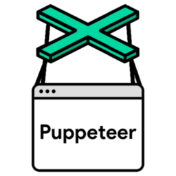

# ioBroker.puppeteer

[](https://www.npmjs.com/package/iobroker.puppeteer)
[](https://www.npmjs.com/package/iobroker.puppeteer)


[](https://nodei.co/npm/iobroker.puppeteer/)

**Tests:** 

## puppeteer adapter for ioBroker

Headless browser to generate screenshots and PDF exports based on Chrome

## Disclaimer
Puppeteer is a product of Google Inc. The developers of this module are in no way endorsed by or affiliated with Google Inc., 
or any associated subsidiaries, logos or trademarks.

## How-To
The adapter is fully configurable via states and does not provide settings in the admin interface.
The states (besides `url`) will not get any ack-flag by the adapter and ack-flags are ignored in general.

### States

#### filename
Specify the filename (full path) of the image.

#### url
Specify the url you want to take a screenshot from. If the state is written, a screenshot will be created immediately.
After the screenshot is created, the adapter will set the ack flag of url state to true.

#### fullPage
If this state evaluates to true, it will perform a screenshot of the full page. The crop options will be ignored.

#### cropLeft/Top/Height/Width
Configure the crop options in `px` to only screenshot the desired segment of the page. 
If `fullPage` is set to true, no cropping will be performed.

#### waitForSelector
The screenshot will be taken after the selector is visible on the page e.g. `#time`. If `waitForSelector` is active, 
other wait operations like `renderTime` are ignored.

#### renderTime
Interval in ms to wait till the page will be rendered

### Messages
Alternatively you can take screenshots or export PDFs by sending messages to the adapter.
All options beside from `url`, `ioBrokerOptions` and `loginCredentials` are passed directly to the Puppeteer API, the currently supported parameters can be found
below, for a more up-to-date version check the [API description](https://pptr.dev/api/puppeteer.screenshotoptions). 
Additionally, you can define a `waitOption` to wait for a given time or for a selector. Finally, you can use the `ioBrokerOptions.storagePath` 
option to save screenshots/PDFs directly to the ioBroker storage under `0_userdata.0` which can then be viewed via admin and visualization adapters.

### ioBroker Web Login
The adapter can automatically handle ioBroker web login pages (e.g., for VIS). Configure the credentials in the adapter settings under "ioBroker Web Login Credentials", 
or pass them dynamically using the `loginCredentials` option in messages. The adapter will automatically detect login forms and authenticate before taking screenshots or exporting PDFs.

#### Screenshot via Messages

```typescript
sendTo('puppeteer.0', 'screenshot', { url: 'https://www.google.com',
      ioBrokerOptions?: {
        /**
         * Define a filename for the ioBroker storage e.g. test.png
         */
        storagePath: string;
      },
      /**
       * Optional login credentials for ioBroker web pages
       */
      loginCredentials?: {
        username: 'admin',
        password: 'password'
      },
      /**
       * Define at most one wait option
       * You can also look for other waitOptions currently supported by Puppeteer API
       * see e.g. https://puppeteer.github.io/puppeteer/docs/puppeteer.page.waitforfilechooser
       */
      waitOption?: {
        /**
         * Define a Timeout in ms
         */
        waitForTimeout?: 5000,
    
        /**
         * Wait for a given id/tag/etc to be occured
         */
        waitForSelector?: '#testId'
      },
      /**
       * Optionally, specify the viewport manually, see https://pptr.dev/api/puppeteer.viewport
       */
      viewportOptions?: {
        width: 800,
        height: 600
      },
      /**
       * The file path to save the image to. The screenshot type will be inferred
       * from file extension. If path is a relative path, then it is resolved
       * relative to current working directory. If no path is provided, the image
       * won't be saved to the disk.
       */
      path?: string,
      /**
       * When true, takes a screenshot of the full page.
       * @defaultValue false
       */
      fullPage?: boolean,
      /**
       * An object which specifies the clipping region of the page.
       */
      clip?: {         
        x: number,
        y: number,
        width: number,
        height: number 
      };
      /**
       * Quality of the image, between 0-100. Not applicable to `png` images.
       */
      quality?: number,
      /**
       * Hides default white background and allows capturing screenshots with transparency.
       * @defaultValue false
       */
      omitBackground?: boolean,
      /**
       * Encoding of the image.
       * @defaultValue 'binary'
       */
      encoding?: 'base64' | 'binary',
      /**
       * If you need a screenshot bigger than the Viewport
       * @defaultValue true
       */
      captureBeyondViewport?: boolean,
  }, obj => {
      if (obj.error) {
        log(`Error taking screenshot: ${obj.error.message}`, 'error');
      } else {
        // the binary representation of the image is contained in `obj.result`
        log(`Successfully took screenshot: ${obj.result}`);
      }
});
```

#### PDF Export via Messages

```typescript
sendTo('puppeteer.0', 'pdf', { url: 'https://www.google.com',
      ioBrokerOptions?: {
        /**
         * Define a filename for the ioBroker storage e.g. document.pdf
         */
        storagePath: string;
      },
      /**
       * Optional login credentials for ioBroker web pages
       */
      loginCredentials?: {
        username: 'admin',
        password: 'password'
      },
      /**
       * Define at most one wait option
       */
      waitOption?: {
        waitForTimeout?: 5000,
        waitForSelector?: '#testId'
      },
      /**
       * The file path to save the PDF to. If path is a relative path, then it is resolved
       * relative to current working directory. If no path is provided, the PDF
       * won't be saved to the disk.
       */
      path?: string,
      /**
       * Scales the rendering of the web page. Amount must be between 0.1 and 2.
       * @defaultValue 1
       */
      scale?: number,
      /**
       * Whether to show the header and footer.
       * @defaultValue false
       */
      displayHeaderFooter?: boolean,
      /**
       * HTML template for the print header.
       */
      headerTemplate?: string,
      /**
       * HTML template for the print footer.
       */
      footerTemplate?: string,
      /**
       * Set to `true` to print background graphics.
       * @defaultValue false
       */
      printBackground?: boolean,
      /**
       * Whether to print in landscape orientation.
       * @defaultValue false
       */
      landscape?: boolean,
      /**
       * Paper ranges to print, e.g. '1-5, 8, 11-13'.
       * @defaultValue The empty string, which means all pages are printed.
       */
      pageRanges?: string,
      /**
       * Paper format. If set, takes priority over width and height options.
       * @defaultValue 'Letter'
       */
      format?: 'Letter' | 'Legal' | 'Tabloid' | 'Ledger' | 'A0' | 'A1' | 'A2' | 'A3' | 'A4' | 'A5' | 'A6',
      /**
       * Sets the width of paper. You can pass in a number or a string with a unit.
       */
      width?: string | number,
      /**
       * Sets the height of paper. You can pass in a number or a string with a unit.
       */
      height?: string | number,
      /**
       * Set the PDF margins.
       * @defaultValue no margins are set.
       */
      margin?: {
        top?: string | number,
        right?: string | number,
        bottom?: string | number,
        left?: string | number
      },
      /**
       * Give any CSS @page size declared in the page priority over what is
       * declared in the width or height or format option.
       * @defaultValue false
       */
      preferCSSPageSize?: boolean,
  }, obj => {
      if (obj.error) {
        log(`Error exporting PDF: ${obj.error.message}`, 'error');
      } else {
        // the binary representation of the PDF is contained in `obj.result`
        log(`Successfully exported PDF: ${obj.result}`);
      }
});
```

## Web extension (Screenshot via GET request)

This adapter can register itself as an extension of the ioBroker `web` adapter. Once enabled, screenshots can be
created with a simple HTTP `GET` request - no scripting or message required. This is handy for dashboards, `img`
tags, external monitoring tools or `curl`.

### Enabling

1. Open the adapter settings and, under **Web extension**, select the `web` instance that should serve the endpoint
   (or "All web instances"). This is stored in `native.webInstance` (`*` = all web instances).
2. Save. The `web` adapter loads the extension and the endpoint becomes available under the web server's address.

### Endpoint

```
GET http://<iobroker-ip>:8082/puppeteer-enhanced/screenshot?url=<url>
```

The response is the raw image (`image/png` by default), so you can point a browser, an `` tag or a
VIS/`vis-2` widget directly at the URL.

#### Examples

```
# Simple screenshot
http://192.168.1.100:8082/puppeteer-enhanced/screenshot?url=https://www.iobroker.net

# Full page as JPEG
http://192.168.1.100:8082/puppeteer-enhanced/screenshot?url=https://www.iobroker.net&type=jpeg&fullPage=true

# Fixed viewport, wait for a selector, and force a download
http://192.168.1.100:8082/puppeteer-enhanced/screenshot?url=http://192.168.1.100:8082/vis-2/&width=1920&height=1080&waitForSelector=%23vis_container&filename=dashboard.png

# ioBroker VIS behind a login
http://192.168.1.100:8082/puppeteer-enhanced/screenshot?url=http://192.168.1.100:8082/vis/index.html&username=admin&password=secret
```

#### Query parameters

| Parameter                                   | Description                                                                      |
|---------------------------------------------|----------------------------------------------------------------------------------|
| `url`                                       | **Required.** URL to take a screenshot of                                        |
| `type` / `format`                           | Image type: `png` (default), `jpeg`, `webp`                                      |
| `fullPage`                                  | `true`/`false` - capture the full page (crop is ignored)                         |
| `width`, `height`                           | Viewport size in px (both required to take effect)                               |
| `quality`                                   | Image quality 0-100 (JPEG/WebP only)                                             |
| `omitBackground`                            | `true`/`false` - transparent background                                          |
| `clipX`, `clipY`, `clipWidth`, `clipHeight` | Clip region in px (ignored when `fullPage=true`)                                 |
| `waitForSelector`                           | Wait for this CSS selector before capturing, e.g. `%23time`                      |
| `renderTime`                                | Milliseconds to wait before capturing (ignored if `waitForSelector` is set)      |
| `username`, `password`                      | Optional ioBroker web login credentials                                          |
| `storagePath`                               | Additionally store the image under `0_userdata.0`, e.g. `screenshots/dash.png`   |
| `filename`                                  | Suggested download filename (sets `Content-Disposition`)                         |
| `requestTimeout`                            | Milliseconds to wait for the screenshot before returning `504` (default `60000`) |

> The extension runs inside the `web` adapter process and forwards each request to the running
> `puppeteer-enhanced` instance, so the already launched browser is reused.
>
> If the selected `web` instance has authentication enabled, the request must be authenticated accordingly
> (or use a web instance without authentication for these endpoints).

## Usage Examples

Below are practical JavaScript code examples for use in ioBroker scripts (JS/Blockly adapter).

### Screenshot Examples

#### 1. Simple Screenshot
```javascript
sendTo('puppeteer-enhanced.0', 'screenshot', 'https://www.google.com', (result) => {
    if (result.error) {
        console.log('Error: ' + result.error.message);
    } else {
        console.log('Screenshot taken successfully');
    }
});
```

#### 2. Screenshot Saved to File Path
```javascript
sendTo('puppeteer-enhanced.0', 'screenshot', {
    url: 'https://www.google.com',
    path: '/tmp/screenshot.png',
    fullPage: true
}, (result) => {
    console.log('Screenshot saved to /tmp/screenshot.png');
});
```

#### 3. Screenshot Saved to ioBroker Storage
```javascript
sendTo('puppeteer-enhanced.0', 'screenshot', {
    url: 'https://www.google.com',
    ioBrokerOptions: {
        storagePath: 'screenshots/google.png'
    }
}, (result) => {
    console.log('Screenshot saved to ioBroker storage under 0_userdata.0');
});
```

#### 4. Screenshot of ioBroker VIS with Login Credentials
```javascript
sendTo('puppeteer-enhanced.0', 'screenshot', {
    url: 'http://192.168.1.100:8082/vis/index.html',
    path: '/tmp/vis-screenshot.png',
    loginCredentials: {
        username: 'admin',
        password: 'mypassword'
    },
    fullPage: true
}, (result) => {
    console.log('VIS screenshot with login taken');
});
```

#### 5. Screenshot with Selector and Viewport Options
```javascript
sendTo('puppeteer-enhanced.0', 'screenshot', {
    url: 'https://www.example.com',
    path: '/tmp/example.png',
    waitOption: {
        waitForSelector: '#main-content'
    },
    viewportOptions: {
        width: 1920,
        height: 1080
    }
});
```

### PDF Export Examples

#### 6. Simple PDF Export
```javascript
sendTo('puppeteer-enhanced.0', 'pdf', {
    url: 'https://www.google.com',
    path: '/tmp/google.pdf'
}, (result) => {
    if (result.error) {
        console.log('Error: ' + result.error.message);
    } else {
        console.log('PDF exported successfully');
    }
});
```

#### 7. PDF Export with A4 Format and Margins
```javascript
sendTo('puppeteer-enhanced.0', 'pdf', {
    url: 'https://www.example.com',
    path: '/tmp/document.pdf',
    format: 'A4',
    printBackground: true,
    margin: {
        top: '20mm',
        right: '20mm',
        bottom: '20mm',
        left: '20mm'
    }
}, (result) => {
    console.log('A4 PDF with margins created');
});
```

#### 8. Landscape PDF Export with Header and Footer
```javascript
sendTo('puppeteer-enhanced.0', 'pdf', {
    url: 'https://www.example.com',
    path: '/tmp/landscape.pdf',
    format: 'A4',
    landscape: true,
    displayHeaderFooter: true,
    headerTemplate: '<div style="font-size: 10px; text-align: center; width: 100%;">Header</div>',
    footerTemplate: '<div style="font-size: 10px; text-align: center; width: 100%;"><span class="pageNumber"></span>/<span class="totalPages"></span></div>',
    printBackground: true
});
```

#### 9. PDF Export from ioBroker VIS with Authentication
```javascript
sendTo('puppeteer-enhanced.0', 'pdf', {
    url: 'http://192.168.1.100:8082/vis/index.html',
    path: '/tmp/vis-export.pdf',
    loginCredentials: {
        username: 'admin',
        password: 'mypassword'
    },
    format: 'A4',
    printBackground: true,
    waitOption: {
        waitForSelector: '#vis_container'
    }
}, (result) => {
    console.log('VIS exported to PDF with authentication');
});
```

#### 10. PDF Export Saved to ioBroker Storage
```javascript
sendTo('puppeteer-enhanced.0', 'pdf', {
    url: 'https://www.example.com',
    ioBrokerOptions: {
        storagePath: 'documents/report.pdf'
    },
    format: 'A4',
    printBackground: true,
    margin: {
        top: '10mm',
        bottom: '10mm'
    }
});
```

#### 11. PDF Export with Page Ranges
```javascript
sendTo('puppeteer-enhanced.0', 'pdf', {
    url: 'https://www.example.com',
    path: '/tmp/pages.pdf',
    pageRanges: '1-3, 5',
    format: 'A4'
});
```

### State-Based Screenshot (Legacy Method)

```javascript
// Example using state objects
setState('puppeteer-enhanced.0.filename', '/tmp/state-screenshot.png', false);
setState('puppeteer-enhanced.0.fullPage', true, false);
setState('puppeteer-enhanced.0.url', 'https://www.google.com', false); // Triggers the screenshot
```

## Changelog
<!--
    Placeholder for the next version (at the beginning of the line):
    ### **WORK IN PROGRESS**
-->
### **WORK IN PROGRESS**
* Added web extension: screenshots can now be created via a GET request (`/puppeteer-enhanced/screenshot?url=...`) when the adapter is registered as an extension of the `web` adapter
* Added `webInstance` setting to select which `web` instance serves the screenshot endpoint
* Added `maxParallelProcesses` setting to limit how many screenshots/PDFs are rendered in parallel; further requests are queued (set to 1 on low-memory devices like a Raspberry Pi to avoid running out of RAM)
* Fixed screenshot handling for object messages, where the `url` was not read from the message

### 0.5.2 (2026-07-20)
* Updated repository casing to ioBroker.puppeteer-enhanced and added usage examples in README.md

### 0.5.1 (2026-07-20)
* Updated repository checker requirements, dependencies, Node.js 22 support, and admin i18n translations

### 0.5.0 (2026-02-11)
* Added PDF export functionality via 'pdf' command
* Added automatic ioBroker web login detection and authentication
* Added login credentials support (configurable in adapter settings or via messages)
* PDF export supports all Puppeteer PDF options (format, margins, landscape, etc.)

### 0.4.0 (2024-09-17)
* (@foxriver76) updated puppeteer dependency
* (@foxriver76) allow to specify an external browser for puppeteer

### 0.3.0 (2024-05-19)
* (foxriver76) allowed to specify additional arguments for the puppeteer process
* (foxriver76) updated puppeteer dependency

### 0.2.8 (2024-01-09)
* (foxriver76) update puppeteer dependency

### 0.2.7 (2023-03-18)
* (foxriver76) update puppeteer dependency

### 0.2.6 (2022-08-14)
* (foxriver76) we now close the page also when screenshot taken via message

### 0.2.5 (2022-08-14)
* (foxriver76) we have optimized the viewport option

### 0.2.4 (2022-08-12)
* (foxriver76) allow settings viewport options
* (foxriver76) the default viewport is now the max resolution

### 0.2.3 (2022-08-12)
* (foxriver76) optimized path check for relative paths

### 0.2.1 (2022-06-09)
* (foxriver76) we now install required shared libraries on adapter installation on linux

### 0.2.0 (2022-05-20)
* (foxriver76) added option to save files to the ioBroker storage via messages by using `ioBrokerOptions.storagePath` (closes #2)

### 0.1.0 (2022-05-16)
* (foxriver76) initial release

See [older changelog entries](CHANGELOG_OLD.md) for previous releases.

## License
MIT License

Copyright (c) 2026 gokturk413 <gokturk413@gmail.com>

Permission is hereby granted, free of charge, to any person obtaining a copy
of this software and associated documentation files (the "Software"), to deal
in the Software without restriction, including without limitation the rights
to use, copy, modify, merge, publish, distribute, sublicense, and/or sell
copies of the Software, and to permit persons to whom the Software is
furnished to do so, subject to the following conditions:

The above copyright notice and this permission notice shall be included in all
copies or substantial portions of the Software.

THE SOFTWARE IS PROVIDED "AS IS", WITHOUT WARRANTY OF ANY KIND, EXPRESS OR
IMPLIED, INCLUDING BUT NOT LIMITED TO THE WARRANTIES OF MERCHANTABILITY,
FITNESS FOR A PARTICULAR PURPOSE AND NONINFRINGEMENT. IN NO EVENT SHALL THE
AUTHORS OR COPYRIGHT HOLDERS BE LIABLE FOR ANY CLAIM, DAMAGES OR OTHER
LIABILITY, WHETHER IN AN ACTION OF CONTRACT, TORT OR OTHERWISE, ARISING FROM,
OUT OF OR IN CONNECTION WITH THE SOFTWARE OR THE USE OR OTHER DEALINGS IN THE
SOFTWARE.
